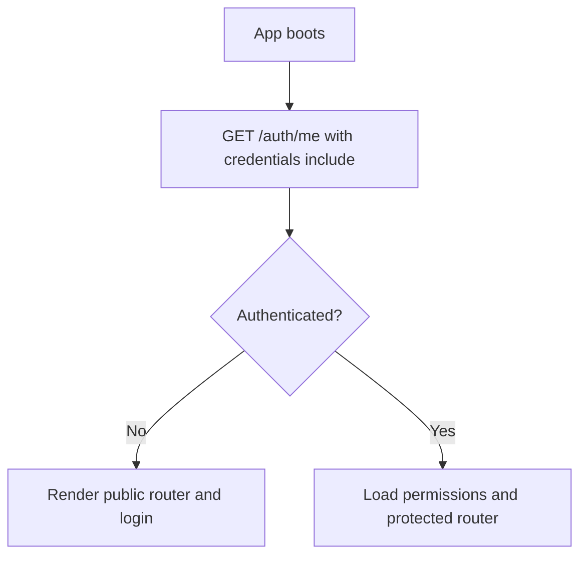
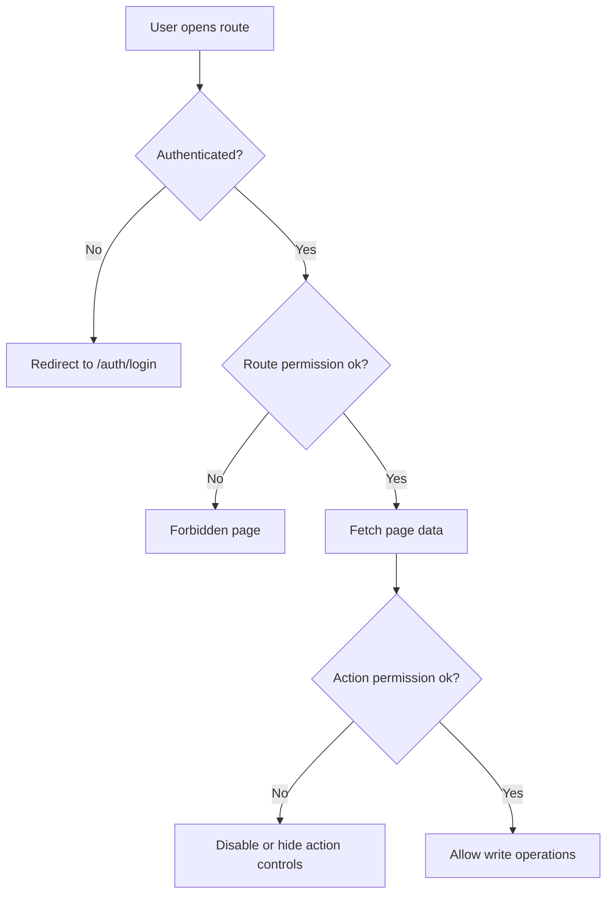
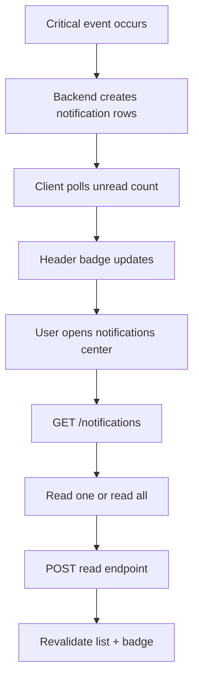
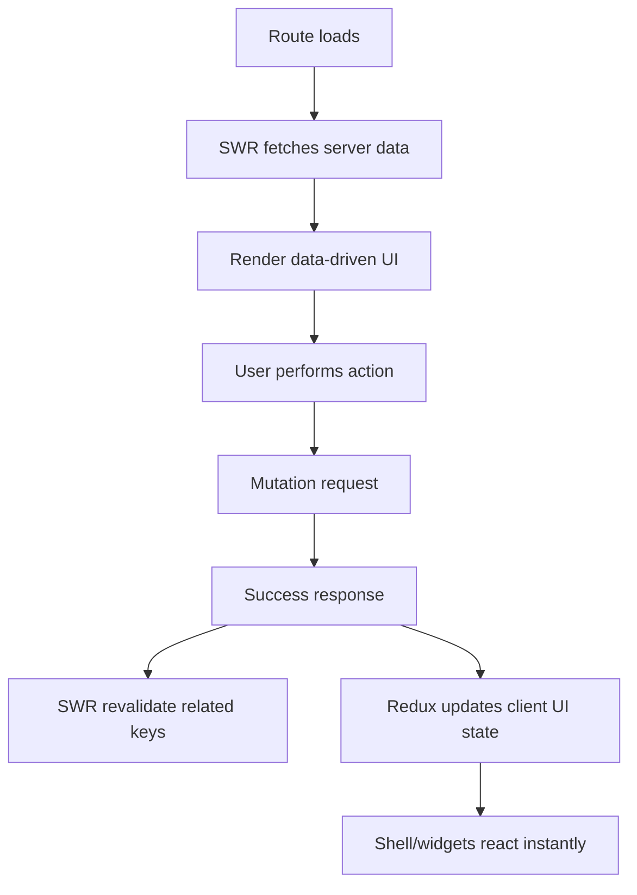
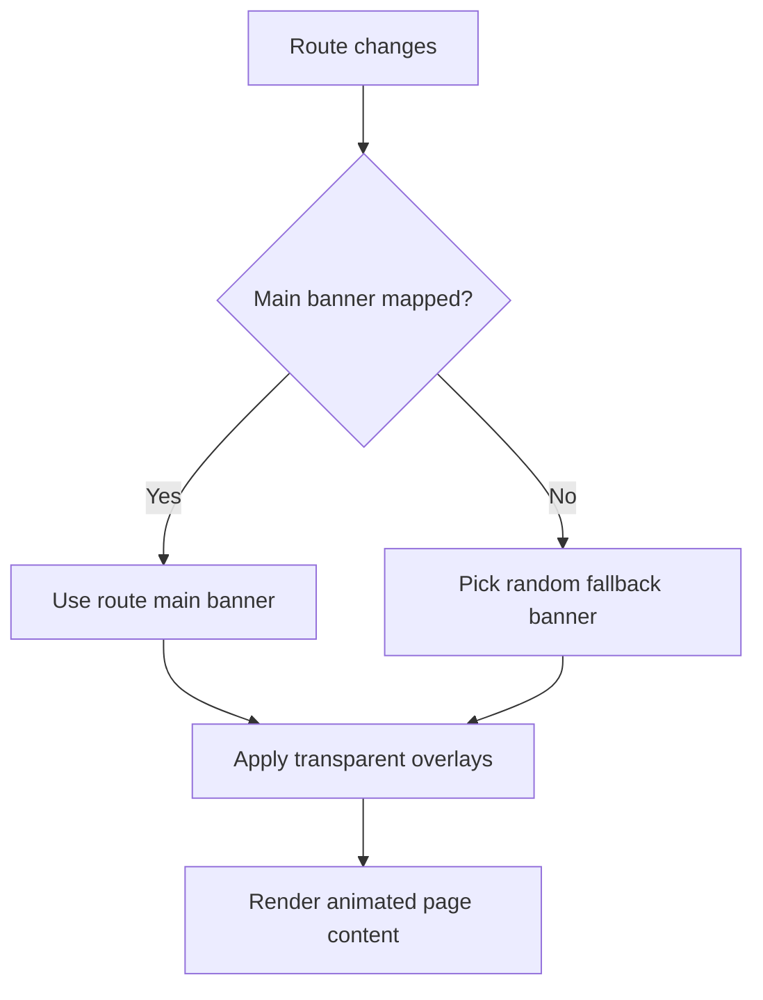

# CodeBlack Frontend Execution Plan

## 1. Goal
Build a production-ready SPA in `frontend/` using HeroUI v3 + Tailwind v4, fully aligned with existing backend APIs (`/api/v1`), and delivered in the same operational pattern you used for backend:

1. implement a phase
2. verify the phase
3. commit the phase

The backend remains the single source of truth for data, permissions, and workflow state.

## 2. Stack and Non-Negotiables
- React 19 + Vite
- HeroUI v3 as the UI core
- Tailwind CSS v4 for utility styling
- React Router for SPA route architecture
- SWR for fetch/cache/revalidation
- Redux Toolkit + React Redux for app-wide client state
- JWT-based authentication/session model
- Framer Motion for route/page/component animation
- No hardcoded permission decisions in UI beyond local display guards
- Every privileged action validated again by backend

Required supporting stack for a feature-rich frontend:
- `@reduxjs/toolkit` and `react-redux`
- `redux-persist` for non-sensitive UI/session preferences only
- `react-hook-form`, `zod`, `@hookform/resolvers` for robust form handling
- `sonner` (or equivalent) for global toasts
- `dayjs` for reliable date formatting and comparisons
- `lucide-react` for icon consistency
- `clsx` + `tailwind-merge` for clean conditional styling
- `react-error-boundary` for route-level and feature-level fallback UIs
- `vitest` + `@testing-library/react` + `@testing-library/jest-dom` for unit/integration tests
- `msw` for deterministic API mocking in tests
- `playwright` for end-to-end smoke flows (auth, submissions, reviews)

## 3. Existing Inputs in This Repository
- Backend modules exist for auth, permissions, applications, orders, roster, playerbase, blacklist, activities, vacations, voting, notifications, admin, config, and bot control.
- HeroUI v2 templates are available in `templates/` and will be used as visual references only.
- Media assets are available in `codeblack-media/main/` and `codeblack-media/random/`.

## 4. Frontend Architecture
Use feature-first architecture with shared app/core layers.

```text
frontend/src/
  app/
    providers/
    router/
    bootstrap/
    store/
  core/
    api/
    auth/
    permissions/
    config/
    errors/
  shared/
    layout/
    motion/
    ui/
    hooks/
    utils/
  features/
    auth/
    dashboard/
    applications/
    orders/
    roster/
    playerbase/
    blacklist/
    activities/
    vacations/
    voting/
    notifications/
    admin/
    permissions/
    bot-control/
    config-registry/
```

Feature module standard:
- `api/`: endpoint wrappers
- `hooks/`: SWR queries + mutation hooks
- `store/` (optional): feature-specific redux slices/selectors when needed
- `components/`: reusable feature UI
- `pages/`: route screens
- `types/`: DTO contracts

## 5. Design Direction
### 5.1 Layout shell
HeroUI v3 does not provide the old v2 navbar pattern, so build a custom shell with HeroUI primitives:
- top header with brand, global actions, notifications, and profile menu
- responsive sidebar (desktop persistent, mobile drawer)
- animated route viewport

### 5.2 Transparent background system
Use layered backgrounds:
- base: transparent page background
- media layer: route-mapped banner from `codeblack-media/main/`
- fallback media layer: random image from `codeblack-media/random/`
- readability layer: translucent gradient overlays + blur where needed

Initial route banner mapping:
- `/dashboard` -> `codeblack-media/main/codeblack-glitched-banner.gif`
- `/applications*` -> `codeblack-media/main/application-banner.png`
- `/roster*` -> `codeblack-media/main/hall-of-fame-roster-banner.png`
- `/activities*` and `/vacations*` -> `codeblack-media/main/gathering-for-patrol.png`
- everything else -> random fallback image

### 5.3 Motion language
- route enter/exit: fade + vertical offset
- list/table reveal: staggered child animation
- modal/drawer: spring motion
- stats cards and action tiles: subtle hover lift and glow
- honor `prefers-reduced-motion`

### 5.4 Theme protection rule
- Preserve existing `frontend/src/index.css` light/dark theme color variables exactly as-is.
- Allowed: adding new CSS selectors/utilities/variables that do not modify existing light/dark color tokens.
- Not allowed: changing current color values under `:root`/light theme or `.dark` theme blocks.

## 6. Data and API Model
### 6.1 API client
- `VITE_API_BASE_URL` controls backend origin
- one HTTP layer supports JSON and multipart
- default request mode uses `credentials: "include"` for JWT cookie auth
- optional Bearer header compatibility path (temporary migration mode only)
- normalized API error envelope

### 6.2 Auth/session
- Discord login flow through backend auth endpoints
- backend issues JWT session on callback (cookie-based)
- frontend never stores auth token in `localStorage` or `sessionStorage`
- `AuthProvider` hydrates user via `/api/v1/auth/me`
- 401 triggers session reset and redirect to login

### 6.3 JWT session handling strategy
Primary model:
- access JWT in `HttpOnly`, `Secure`, `SameSite` cookie
- frontend treats cookie as opaque and does not read token value
- API client always sends cookies with requests

Security requirements:
- CSRF protection for state-changing requests
- short JWT TTL with backend-controlled invalidation on logout/revoke
- strict CORS configuration for credentialed requests

### 6.4 SWR policy
- use `useSWR` for GET reads
- use mutation hooks for writes
- after successful writes, revalidate related keys
- key convention: array keys `['domain', 'resource', params]`

### 6.5 Redux policy
Redux is used for cross-feature client state, not backend source-of-truth data.

Use Redux for:
- auth/session metadata snapshot for fast UI checks
- permission matrix cache and role UI context
- app shell state (sidebar open state, selected workspace/group context)
- notification UI state (drawer open, filters, local read markers before refetch)
- in-progress multi-step forms and wizard drafts

Do not use Redux for:
- primary server lists/details that SWR already manages
- permission enforcement logic (backend still decides)
- replacing SWR cache

State ownership model:
- backend: authoritative business state
- SWR: fetched server state and synchronization
- Redux: global client orchestration and UX state

## 7. Routing and Access Model
Public routes:
- `/`
- `/auth/login`
- `/auth/callback`
- `/applications/new`
- `/applications/eligibility`
- `/blacklist/removal-request`

Authenticated routes:
- `/dashboard`
- `/notifications`
- `/applications`
- `/applications/:publicId`
- `/orders`
- `/orders/:publicId`
- `/roster`
- `/playerbase`
- `/blacklist`
- `/activities`
- `/activities/:publicId`
- `/vacations`
- `/voting/:contextType/:contextId`

Staff/elevated routes:
- `/admin/review-queue`
- `/admin/audit`
- `/permissions/role-matrix`
- `/config/registry`
- `/bot/control`

Guard rules:
- route guard: auth + permission key checks
- action guard: hide/disable buttons per permission
- owner override when backend marks user as owner
- forbidden state UI must explain why access is denied

## 8. Endpoint Integration Matrix (By Feature)
Auth:
- `/auth/discord/login`
- `/auth/discord/callback`
- `/auth/me`
- `/auth/logout`

Applications:
- `/applications` POST multipart
- `/applications/eligibility`
- `/applications` GET
- `/applications/{public_id}` GET
- `/applications/{public_id}/decision` POST
- `/applications/policies` GET/PUT

Orders:
- `/orders` POST multipart
- `/orders` GET
- `/orders/{public_id}` GET
- `/orders/{public_id}/decision` POST
- `/users/{user_id}/account-link` GET/POST

Roster and playerbase:
- `/roster` GET/POST/PATCH
- `/roster/groups` GET/POST
- `/roster/ranks/{group_code}` GET
- `/roster/ranks` POST
- `/playerbase` GET/POST
- `/playerbase/{player_id}` GET
- `/playerbase/{player_id}/punishments` GET/POST/PATCH

Blacklist:
- `/blacklist` GET/POST/PATCH
- `/blacklist/{entry_id}/remove` POST
- `/blacklist/removal-requests` GET/POST
- `/blacklist/removal-requests/{id}` GET
- `/blacklist/removal-requests/{id}/approve` POST
- `/blacklist/removal-requests/{id}/deny` POST

Activities:
- `/activities` GET/POST
- `/activities/{public_id}` GET
- `/activities/{public_id}/approve` POST
- `/activities/{public_id}/reject` POST
- `/activities/{public_id}/participants` POST
- `/activities/{public_id}/publish` POST

Vacations:
- `/vacations` GET/POST
- `/vacations/policies` GET
- `/vacations/{public_id}` GET
- `/vacations/{public_id}/approve` POST
- `/vacations/{public_id}/deny` POST
- `/vacations/{public_id}/cancel` POST
- `/vacations/{public_id}/returned` POST

Voting:
- `/voting/{context_type}/{context_id}` GET
- `/voting/{context_type}/{context_id}/vote` POST
- `/voting/{context_type}/{context_id}/voters` GET
- `/voting/{context_type}/{context_id}/close` POST
- `/voting/{context_type}/{context_id}/reopen` POST
- `/voting/{context_type}/{context_id}/reset` POST

Notifications and admin:
- `/notifications`
- `/notifications/unread-count`
- `/notifications/{id}/read`
- `/notifications/read-all`
- `/notifications/broadcast`
- `/admin/dashboard/summary`
- `/admin/review-queue`
- `/admin/audit/timeline`
- `/permissions/role-matrix` GET/PUT
- `/bot/channels` GET/PUT
- `/bot/features` GET/PUT
- `/bot/triggers/forum-sync` POST
- `/bot/triggers/cop-scores-refresh` POST
- `/bot/dead-letter` GET
- `/bot/dead-letter/{id}/replay` POST
- `/config/*`

## 9. Interactivity Graphs
### 9.1 App boot, auth, and route hydration

### 9.2 Protected route and action-level permissions


### 9.3 Application lifecycle (guest/member -> review)
```mermaid
flowchart TD
  A[User opens application form] --> B[GET /applications/eligibility]
  B --> C{Allowed now?}
  C -- No --> D[Show reason and next allowed date]
  C -- Yes --> E[Submit form + images]
  E --> F[POST /applications]
  F --> G[Pending state]
  G --> H[Reviewer decision]
  H --> I[POST /applications/{id}/decision]
  I --> J[Notification emitted]
```

### 9.4 Orders lifecycle
```mermaid
flowchart TD
  A[Authorized member opens order form] --> B[Resolve account name from linked user]
  B --> C[Submit completed order + proof image]
  C --> D[POST /orders]
  D --> E[Order pending]
  E --> F[High staff reviews]
  F --> G[POST /orders/{id}/decision]
  G --> H[User notified]
```

### 9.5 Activity approval and forum publish
```mermaid
flowchart TD
  A[Member creates activity] --> B[Activity pending]
  B --> C[Reviewer approve or reject]
  C --> D{Approved?}
  D -- No --> E[Rejected with reason]
  D -- Yes --> F[Optional schedule window]
  F --> G[Publish request]
  G --> H[POST /activities/{id}/publish]
  H --> I{Bot publish success?}
  I -- Yes --> J[Persist forum references]
  I -- No --> K[Mark publish_failed and allow retry]
```

### 9.6 Notification flow across modules


### 9.7 SWR + Redux interaction model


### 9.8 Visual background resolver flow


## 10. Phased Delivery Plan
### Phase F0 - Foundation
Scope:
- Router, providers, API core, auth core, SWR config, motion presets
- Redux store setup, base slices, typed hooks
- Custom shell (header + sidebar + content viewport)
- Background resolver and media registry

Verify:
- `npm run build`
- `npm run lint`
- manual route smoke (`/`, `/auth/login`, `/dashboard` placeholder)

Commit:
- `frontend: scaffold shell providers router swr redux and motion`

### Phase F1 - Auth and access control
Scope:
- Discord login page, callback page, logout flow
- JWT cookie-based session hydration and logout invalidation
- route/action permission guards
- CSRF-aware write request wiring

Verify:
- login and logout end to end
- protected route redirect behavior
- unauthorized action states
- confirm no auth token is persisted in `localStorage`/`sessionStorage`

Commit:
- `frontend: add discord auth flow and permission guards`

### Phase F2 - Public/member submissions
Scope:
- application creation, eligibility check, submission result
- blacklist removal request submission
- order submission with proof upload

Verify:
- multipart image uploads
- guest captcha path behavior
- validation and error rendering

Commit:
- `frontend: implement application order and blacklist request forms`

### Phase F3 - Staff review workflows
Scope:
- admin summary and review queue screens
- review detail panel and decision actions
- cross-feature queue handling

Verify:
- queue filters
- decision mutations and immediate revalidation
- permission checks on reviewer actions

Commit:
- `frontend: implement staff review queue and decision workflows`

### Phase F4 - Group operations
Scope:
- roster, playerbase, blacklist management
- activities (create/approve/reject/publish/retry)
- vacations and voting operations

Verify:
- CRUD plus moderation actions
- activity publish state transitions
- voting controls by permission

Commit:
- `frontend: implement roster playerbase blacklist activities vacations and voting`

### Phase F5 - Platform control and governance
Scope:
- notifications center
- permission role matrix manager
- bot channel/feature controls
- config registry dashboard
- audit timeline

Verify:
- privileged endpoints only for authorized users
- two-step config change UI for critical settings

Commit:
- `frontend: implement notifications permissions bot control config and audit pages`

### Phase F6 - UX hardening and release readiness
Scope:
- loading skeletons, empty/error states, boundaries
- responsive tuning (mobile and desktop)
- motion polish and reduced-motion support

Verify:
- `npm run build`
- `npm run lint`
- manual scenario pass for core flows

Commit:
- `frontend: harden UX accessibility and production states`

## 11. Verification Gate for Every Phase
Run before each commit:
- `npm run lint`
- `npm run build`
- manual smoke for changed routes
- manual test for at least one write action and its SWR revalidation
- confirm `frontend/src/index.css` existing light/dark color values were not edited

If verification fails:
- fix
- rerun checks
- then commit

## 12. Immediate Next Step
Start with Phase F0 implementation in `frontend/src/` and keep each phase as a separate commit with verification evidence in commit message body.
